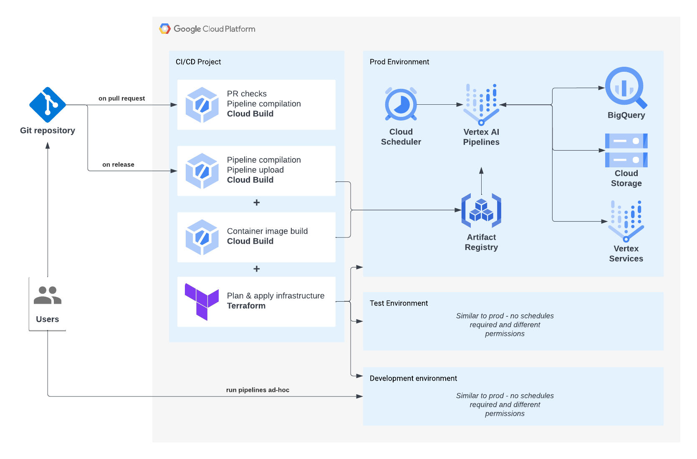

<!--
Copyright 2023 Google LLC

Licensed under the Apache License, Version 2.0 (the "License");
you may not use this file except in compliance with the License.
You may obtain a copy of the License at

    https://www.apache.org/licenses/LICENSE-2.0

Unless required by applicable law or agreed to in writing, software
distributed under the License is distributed on an "AS IS" BASIS,
WITHOUT WARRANTIES OR CONDITIONS OF ANY KIND, either express or implied.
See the License for the specific language governing permissions and
limitations under the License.
 -->

# Vertex Pipelines End-to-End Samples

_AKA "Vertex AI Turbo Templates"_


## Introduction

This repository provides a reference implementation of [Vertex Pipelines](https://cloud.google.com/vertex-ai/docs/pipelines/) for creating a production-ready MLOps solution on Google Cloud.
You can take this repository as a starting point for your own ML use cases.
The implementation includes:

* **Infrastructure-as-Code** using Terraform for a typical dev/test/prod setup of Vertex AI and other relevant services
* **ML training and prediction pipelines** using the Kubeflow Pipelines
* **Reusable Kubeflow components** that can be used in common ML pipelines
* **CI/CD** using Google Cloud Build for linting, testing, and deploying ML pipelines
* **Developer scripts** (Makefile, Python scripts etc.)

**Get started today by following [this step-by-step notebook tutorial](./docs/notebooks)! 🚀**
In this three-part notebook series you'll deploy a Google Cloud project and run production-ready ML pipelines using Vertex AI without writing a single line of code.

## Cloud Architecture

The diagram below shows the cloud architecture for this repository.



There are four different Google Cloud projects in use

* `dev` - a shared sandbox environment for use during development
* `test` - environment for testing new changes before they are promoted to production. This environment should be treated as much as possible like a production environment.
* `prod` - production environment
* `admin` - separate Google Cloud project for setting up CI/CD in Cloud Build (since the CI/CD pipelines operate across the different environments)

Vertex Pipelines are scheduled using Google Cloud Scheduler.
Cloud Scheduler emits a Pub/Sub message that triggers a Cloud Function, which in turn triggers the Vertex Pipeline to run.
_In future, this will be replaced with the Vertex Pipelines Scheduler (once there is a Terraform resource for it)._

## Setup

**Prerequisites:**

- [Terraform](https://www.terraform.io/) for managing cloud infrastructure
- [tfswitch](https://tfswitch.warrensbox.com/) to automatically choose and download an appropriate Terraform version (recommended)
- **Python 3.12.8** (pinned in [`.python-version`](.python-version); also used for pipeline component base images and local Poetry envs)
- [Pyenv](https://github.com/pyenv/pyenv#installation) for managing Python versions
- [Poetry](https://python-poetry.org/) for managing Python dependencies
- [Google Cloud SDK (gcloud)](https://cloud.google.com/sdk/docs/quickstart)
- Make
- Cloned repo

**Deploy infrastructure:**

You will need four Google Cloud projects dev, test, prod, and admin.
The Cloud Build pipelines will run in the _admin_ project, and deploy resources into the dev/test/prod projects.
Before your CI/CD pipelines can deploy the infrastructure, you will need to set up a Terraform state bucket for each environment:

```bash
export DEV_PROJECT_ID=my-dev-gcp-project
export DEV_LOCATION=europe-west2
gcloud storage buckets create gs://$DEV_PROJECT_ID-tfstate \
  --project=$DEV_PROJECT_ID \
  --location=$DEV_LOCATION \
  --uniform-bucket-level-access \
  --public-access-prevention
```

Enable APIs in admin project:

```bash
export ADMIN_PROJECT_ID=my-admin-gcp-project
gcloud services enable cloudresourcemanager.googleapis.com serviceusage.googleapis.com --project=$ADMIN_PROJECT_ID
```

```bash
make deploy env=dev
```

More details about infrastructure are explained in [this guide](docs/Infrastructure.md).
It describes the scheduling of pipelines and how to tear down infrastructure.

**Install dependencies:**

```bash
pyenv install --skip-existing 3.12.8                  # install Python 3.12.8
poetry config virtualenvs.prefer-active-python true   # configure Poetry
make install                                          # install Python dependencies
cd pipelines && poetry run pre-commit install         # install pre-commit hooks
cp env.sh.example env.sh
```

Use Python 3.12.x only (not 3.13/3.14). If Poetry recreates a broken `.venv`, point it at 3.12 explicitly, e.g. `cd components && poetry env use 3.12.8 && poetry install --with dev`.

Update the environment variables for your dev environment in `env.sh`.

**Authenticate to Google Cloud:**

```bash
gcloud auth login
gcloud auth application-default login
```

> **Note:** The `deploy_model` component deploys models to a Vertex AI endpoint using a custom service account. That requires the [Service Account User](https://cloud.google.com/iam/docs/service-account-permissions#user-role) role (`roles/iam.serviceAccountUser`), which includes `iam.serviceAccounts.actAs`, so the pipeline SA can attach itself to the endpoint deployment. See [Attach service accounts to resources](https://cloud.google.com/iam/docs/attach-service-accounts). If you deployed infrastructure before this component was added, re-run `make deploy` while authenticated (commands above) so Terraform can grant the permission.

## Configure Pipeline Variables

Before running pipelines, update [`pipelines/variables/variables.yml`](pipelines/variables/variables.yml) with your Google Cloud project IDs:

```yaml
vertex_project_dev: "my-gcp-project-dev"
vertex_project_staging: "my-gcp-project-staging"
vertex_project_prod: "my-gcp-project-prod"
```

These values are used to detect which environment the pipeline is running in. When a pipeline is triggered, the `VERTEX_PROJECT_ID` environment variable (set in `env.sh`) is matched against these entries to load the correct environment-specific configuration. If `VERTEX_PROJECT_ID` does not match any of the configured project IDs, scheduling is skipped and the pipeline is submitted without creating or modifying any schedules.

### Pipeline Scheduling

Each environment (`dev`, `staging`, `prod`) has its own scheduler configuration in `variables.yml`. When a training or prediction pipeline is triggered, the scheduler config for the current environment is loaded and used to create or remove a Vertex AI pipeline schedule via the [`PipelineJobSchedule`](https://cloud.google.com/vertex-ai/docs/pipelines/schedule-pipeline-run) API.

| Setting | Description |
|---------|-------------|
| `enable_training_scheduler` / `enable_prediction_scheduler` | Set to `true` to create a schedule, `false` to remove any existing one |
| `training_cron` / `prediction_cron` | Cron expression for the schedule (see [crontab.guru](https://crontab.guru/)) |
| `training_max_concurrent_run_count` / `prediction_max_concurrent_run_count` | Max number of pipeline runs that can execute concurrently |
| `training_max_run_count` / `prediction_max_run_count` | Total number of runs before the schedule is paused (`0` for infinite) |

When scheduling is enabled, any previous schedule for that pipeline type is automatically deleted before creating the new one, ensuring only one active schedule exists at a time.

## Run

This repository contains example ML training and prediction pipelines which are explained in [this guide](docs/Pipelines.md).

**Customise the training configuration:** All training configuration lives in two files — you should not need to change anything else to swap model type, hyperparameters, preprocessing, or evaluation metric:

| File | What to change |
|------|---------------|
| [`config/shared/training_config.py`](config/shared/training_config.py) | Add a new model to `_MODEL_REGISTRY` (maps a short name to its fully-qualified import path). Add or remove fields from `TrainingConfig` and `get_model_params()` to match the parameters your model accepts. Add new encoders to the `encoder_registry` inside `get_transformers()` to support additional preprocessing steps. |
| [`pipelines/src/pipelines/training.py`](pipelines/src/pipelines/training.py) | Set the values for all `TrainingConfig` fields: which `model` to use (must match a key in `_MODEL_REGISTRY`), hyperparameter values, preprocessing steps, `use_eval_set`, and `primary_metric`. |

> **Note:** `use_eval_set` should only be set to `True` for models that accept an `eval_set` argument in their `fit()` method (e.g. XGBoost). Leave it as `False` (the default) for standard scikit-learn estimators.

**Build containers:** The [model/](/model/) directory contains the code for custom training and prediction container images, including the model training script at [model/training/train.py](model/training/train.py).
You can modify this to suit your own use case.
Build the training and prediction container images and push them to Artifact Registry with:

```bash
make build [ images="training prediction" ]
```

Optionally specify the `images` variable to only build one of the images.

**Execute pipelines:** Vertex AI Pipelines uses KubeFlow to orchestrate your training steps, as such you'll need to:

1. Compile the pipeline
1. Build dependent Docker containers
1. Run the pipeline in Vertex AI

Execute the following command to run through steps 1-3:

```bash
make run pipeline=training [ build=<true|false> ] [ compile=<true|false> ] [ cache=<true|false> ] [ wait=<true|false> ]
```

The command has the following true/false flags:

- `build` - re-build containers for training & prediction code (limit by setting images=training to build only one of the containers)
- `compile` - re-compile the pipeline to YAML
- `cache` - cache pipeline steps
- `wait` - run the pipeline (a-)sync

**Shortcuts:** Use these commands which support the same options as `run` to run the training or prediction pipeline:

```bash
make training
make prediction
```

## Test

Unit tests are performed using [pytest](https://docs.pytest.org).
The unit tests are run on each pull request.
To run them locally you can execute the following command and optionally enable or disable testing of components:

```
make test [ packages=<pipelines components> ]
```

## Automation

For details on setting up CI/CD, see [this guide](./docs/Automation.md).

## Issues with Vertex AI Custom Code Service Agent

If you run custom training code to train a custom-trained model, then the [Vertex AI Custom Code Service Agent](https://cloud.google.com/vertex-ai/docs/general/access-control) will be used.
In those cases, the agent is created only when you first try to run custom training code which means you can't assign permissions to the agent, like artifact registry reader, from the very beginning.
To tackle this, you can use [this guide](https://github.com/teamdatatonic/terraform-google-vertex-cc-service-agent).
This repo uses the curl command to create a simple custom training job which triggers the creation of the service agent.
You can also edit that code to use `gcloud ai custom-jobs create` to create the job if you want.

Alternatively, Google has another method of triggering the creation of service agents that is currently in pre-GA that can be used instead of the above solution.
You can read more about it [here](https://cloud.google.com/iam/docs/create-service-agents#create).

## Putting it all together

For a full walkthrough of the journey from changing the ML pipeline code to having it scheduled and running in production, please see the guide [here](./docs/Production.md).

We value your contribution, see [this guide](./docs/Contribution.md) for contributing to this project.
